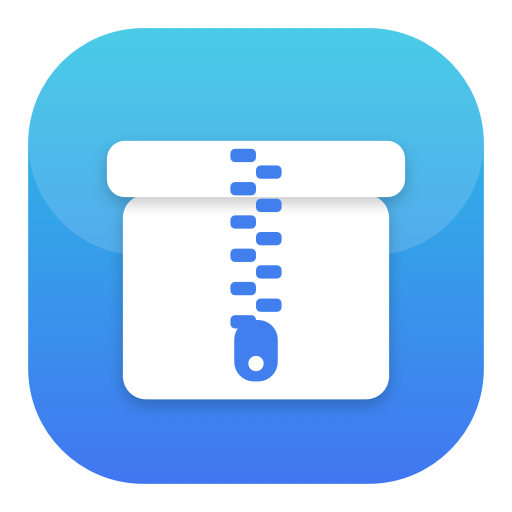
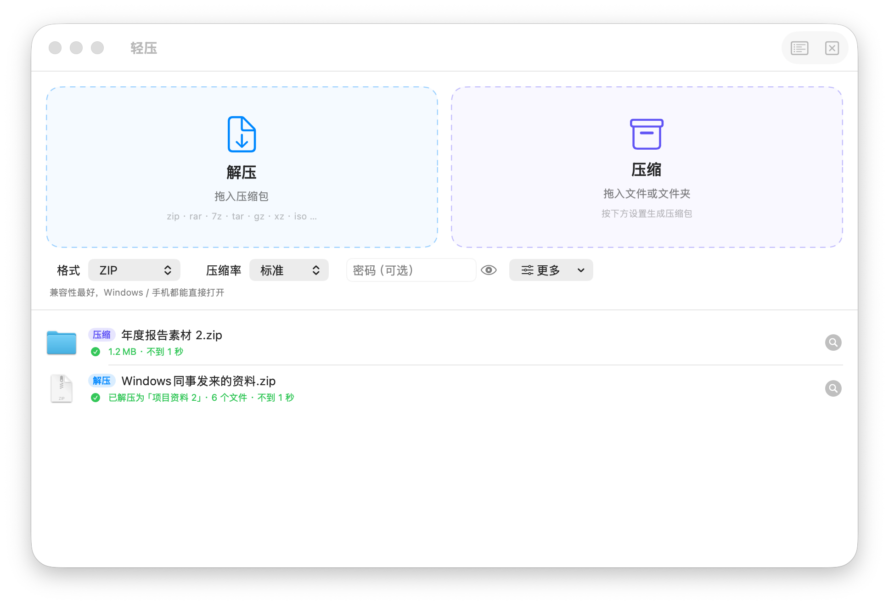
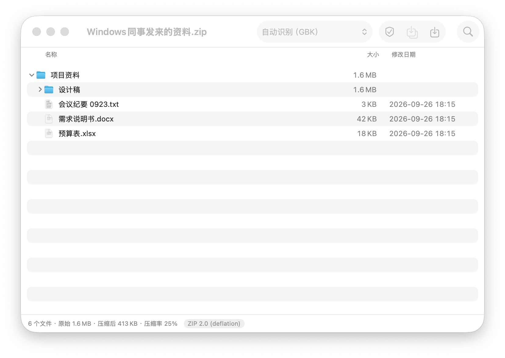
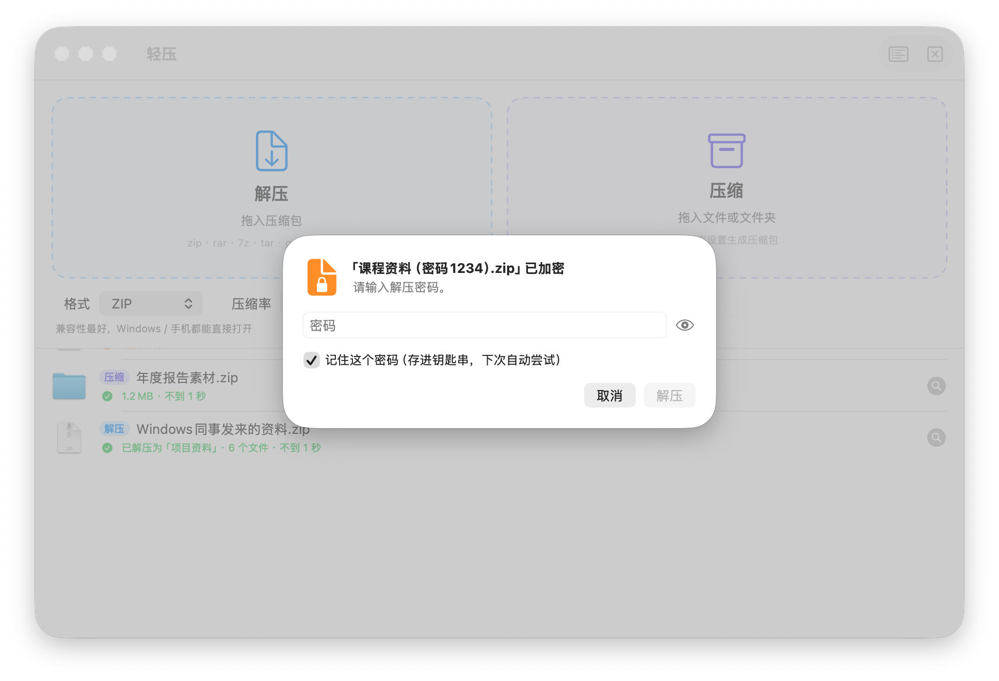

<p align="center">
  
</p>

<h1 align="center">轻压 QingYa</h1>

<p align="center">
  原生 macOS 压缩 / 解压工具。拖进来就能用，Windows 发来的 zip 中文不乱码。<br>
  <sub>A native macOS archiver: smart extraction, GBK/Big5 filename detection, zip AES-256, split volumes.</sub>
</p>

<p align="center">
  
  
  
  
</p>

<p align="center">
  
</p>

综合了 **The Unarchiver**（智能解压、乱码识别）、**Keka**（拖拽压缩、分卷、排除系统文件）、**BetterZip / Bandizip**（浏览内容、选择性解压、密码本）的做法。引擎是 macOS 自带的 libarchive，不用装任何依赖，整个 App 约 3 MB。

## 功能

- **智能解压**：压缩包里只有一个文件夹就直接放出来，零散文件装进同名文件夹，不会出现「资料/资料/…」这种嵌套。重名自动改成「资料 2」，**永不覆盖**已有文件。
- **中文不乱码**：Windows 压缩软件、国产网盘打的 zip 文件名多是 GBK 编码，会自动识别，也支持 Big5、Shift_JIS、EUC-KR。个别还乱码时，可以在浏览窗口里手动切换编码。
- **拖拽压缩**：可以选 ZIP / 7Z / TAR / TAR.GZ / TAR.BZ2 / TAR.XZ 和压缩率。ZIP 支持 AES-256 密码。可以分卷（邮件附件 25 MB、FAT32 U 盘 4 GB），也可以把多个项目分别压缩。`.DS_Store` 等 Mac 隐藏文件默认不打进包里。
- **浏览不解压**：先看里面有什么。双击文件直接预览，右键「解压所选到…」只取需要的部分。「测试」可以检查压缩包有没有损坏。
- **密码本**：加密压缩包会弹框要密码。成功的密码可以存进钥匙串，下次自动尝试，资源站那种统一解压密码只需输一次。
- **安全**：拒绝带 `../` 的恶意路径（Zip Slip），不跟随压缩包里的符号链接写到外面去。解压中途取消或出错，不留半截文件。网上下载的压缩包解出的文件照样会被 Gatekeeper 检查。
- **系统集成**：双击压缩包直接解压（可设为默认打开方式）。拖到程序坞图标上：压缩包会被解压，其他文件会被压缩。访达右键「服务」里有「用轻压压缩 / 解压」。分卷（`.001` / `.part1.rar` / `.r00`）拖任意一卷进来都能自动找齐。

<p align="center">
  
  
</p>

## 下载安装

1. 到 [Releases](../../releases/latest) 下载 `轻压-v1.0.zip`，解压后把「轻压.app」拖进「应用程序」文件夹。
2. 这个 App 没有苹果开发者签名，第一次打开前需要在「终端」运行一次：

   ```bash
   xattr -cr /Applications/轻压.app
   ```

   不想用终端也可以：双击 App → 弹出拦截提示时点「完成」→「系统设置 → 隐私与安全性」→ 拉到最下面点「仍要打开」。
3. （推荐）「轻压 → 设置 → 系统集成」→「设为压缩包的默认打开方式」，以后双击 zip / rar / 7z 就直接解压。

## 支持的格式

| | 格式 |
|---|---|
| 解压 | zip、7z、rar（含 RAR5）、tar、gz / tgz、bz2、xz、lzma、iso、cab、lzh、cpio、xar、deb、rpm、cbz / cbr，以及 `.001`、`.part1.rar`、`.r00` 分卷 |
| 压缩 | zip（可设 AES-256 密码）、7z、tar、tar.gz、tar.bz2、tar.xz，均可分卷 |

**已知限制**：macOS 自带的 libarchive 解不开**带密码的 RAR / 7z**，也不支持 zstd / lz4。装了 7-Zip（`brew install sevenzip`）后，加密的 RAR / 7z 会自动交给它处理，7z 压缩也能设密码并加密文件名。

## 从源码构建

只需要 Xcode Command Line Tools（`xcode-select --install`），不需要完整 Xcode：

```bash
git clone https://github.com/tianfeng66/qingya-mac-archiver.git
cd qingya-mac-archiver
./build.sh          # 产物 build/轻压.app，通用二进制，ad-hoc 签名
./打包分发.sh        # 产物 dist/轻压-v1.0.zip，附带安装说明
```

macOS SDK 带了 `libarchive.tbd`，但没带头文件。`Sources/Bridge/libarchive.h` 按 libarchive 3.7 的签名声明了用到的函数，通过 `-import-objc-header` 桥接进 Swift。

引擎自检（43 项：各格式往返、加密、GBK / Big5 / Shift_JIS、Zip Slip、分卷、损坏检测、取消清理）：

```bash
xcrun swiftc -swift-version 5 -O -import-objc-header Sources/Bridge/libarchive.h -larchive \
    -framework Security Sources/Engine/*.swift Tests/main.swift -o build/selftest
./build/selftest "$PWD/build"
```

## 实现要点

**先解到临时目录，再搬出来。** 解压先写进目标位置下的隐藏目录 `.qingya-xxxx`，成功后才按「智能」规则搬出来。取消、出错或密码不对时直接删掉。

**文件名编码自己判断。** 没有 UTF-8 标记的 zip，libarchive 默认按 CP437 解，出来就是 `╫╩┴╧` 这种乱码。这里让 libarchive 按 Latin-1 把原始字节原样透出来，再把整个包的文件名合在一起交给系统的编码识别（按系统语言优先 GBK / Big5 / Shift_JIS / EUC-KR）。样本越多判断越准。符号链接目标走同一套规则。

**密码验证。** 解压前先用第一个加密文件验证密码：先试这次输入的，再试密码本里记住的。传统 ZipCrypto 的校验字节有 1/256 的概率误判，所以小文件会整个读完，让 CRC 把关。压缩用的密码不落盘。

**进度。** zip / 7z / rar 的目录区读起来很快，先扫一遍拿到总大小，按解出的字节算进度。tar.gz 这类只能顺序读，改按已读的压缩字节占文件大小的比例算。

**分卷。** 压缩时由自定义写回调按字节切成 7-Zip 风格的 `x.zip.001 / .002…`，任何解压软件都认。解压时从任意一卷打开都会找齐全部分卷，交给 `archive_read_open_filenames` 当作一个连续的流读取。

## 文件结构

| 文件 | 作用 |
|---|---|
| `Sources/Bridge/libarchive.h` | libarchive 函数声明 |
| `Sources/Engine/Core.swift` | 错误类型、取消令牌、去重命名、节流 |
| `Sources/Engine/Reader.swift` | 读句柄封装、原始文件名提取、路径净化 |
| `Sources/Engine/Charset.swift` | 文件名编码识别 |
| `Sources/Engine/Extractor.swift` | 列目录、解压、测试、智能放置、隔离属性 |
| `Sources/Engine/Compressor.swift` | 收集文件、写归档、分卷输出 |
| `Sources/Engine/SevenZip.swift` | 可选的 7-Zip 外部引擎 |
| `Sources/Engine/Formats.swift` | 格式定义、分卷识别、文件夹命名 |
| `Sources/App/AppModel.swift` | 任务队列（最多同时 2 个）、位置选择、密码提示 |
| `Sources/App/MainView.swift` | 主窗口：拖放区、压缩选项、任务列表、密码框 |
| `Sources/App/BrowserView.swift` | 浏览窗口 |
| `Sources/App/SettingsView.swift` | 设置 |
| `Sources/App/PasswordStore.swift` | 密码本（钥匙串） |
| `Sources/App/App.swift` | 入口、访达打开、程序坞拖放、服务菜单 |
| `Tools/main.swift` | 生成图标 |
| `Tests/main.swift` | 引擎自检 |

## 隐私

完全本地运行，不联网，不上传任何文件。记住的解压密码只保存在你自己电脑的钥匙串里。

## 许可证

[MIT](LICENSE)
